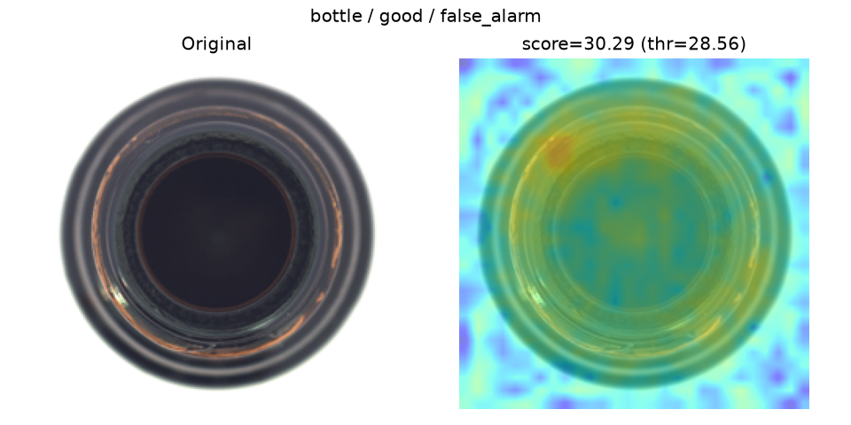
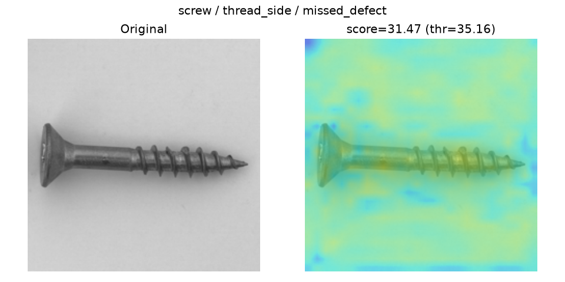
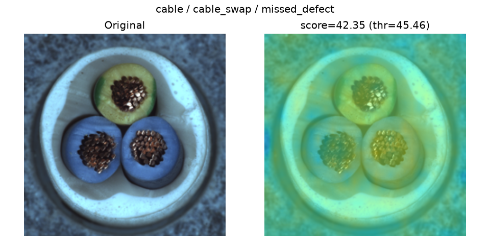

# Model Card: PatchCore Defect Detection

## Overview

Self-supervised anomaly detection for visual quality control. Trained only
on defect-free ("good") images per category; flags and localizes deviations
at test time. Method: pretrained WideResNet50 mid-level patch features +
a 2%-coreset memory bank, scored by nearest-neighbor distance ([src/models/patchcore.py](src/models/patchcore.py)).

Evaluated on four [MVTec AD](https://www.mvtec.com/company/research/datasets/mvtec-ad)
categories chosen to span easy, textural, structural, and semantic defect
types. Full per-category numbers: [docs/results/](docs/results/) (`<category>_summary.json`).

## Results

Ranking quality (AUROC, threshold-independent) vs. actual decisions at the
deployed threshold (`1.1x` the max score seen on `train/good`, see
[src/models/patchcore.py](src/models/patchcore.py)'s `compute_threshold`):

| Category | Image AUROC | Pixel AUROC | Precision | Recall | FP | FN |
|----------|------------:|------------:|----------:|-------:|---:|---:|
| bottle   | 1.000       | 0.984       | 0.969     | 1.000  | 2  | 0  |
| cable    | 0.988       | 0.982       | 0.988     | 0.891  | 1  | 10 |
| screw    | 0.959       | 0.982       | 0.988     | 0.672  | 1  | 39 |
| pill     | 0.956       | 0.982       | 0.984     | 0.872  | 2  | 18 |

**AUROC alone overstates how good the deployed system is.** Every category
scores 0.95+ on ranking quality, but recall at the actual operating
threshold ranges from 0.672 (screw) to 1.000 (bottle) — a 33-point gap that
AUROC never shows, because it only measures whether anomalies rank above
normals, not whether a single fixed cutoff separates them well.

## Failure analysis

### bottle — near-perfect, but not free of false alarms

Recall 1.000 on all three defect types (`broken_large`, `broken_small`,
`contamination`), yet 2 of 20 good test images (10%) trip the threshold
anyway:



The false-alarm score (30.29) sits just above the threshold (28.56) — this
isn't a visual confusion, it's the `1.1x margin` threshold heuristic being
too tight: it's derived from a single number (max score on 209 training
images), so it has no safety margin for benign variation the training set
didn't happen to include. **A real deployment needs a threshold calibrated
on a held-out validation split, not this training-only heuristic.**

### screw — recall collapses for thin, linear defects

Recall 0.672 overall, but it's not uniform:

| Defect type | Recall |
|---|---:|
| thread_side | 0.391 |
| scratch_head | 0.583 |
| manipulated_front | 0.708 |
| thread_top | 0.739 |
| scratch_neck | 0.920 |

Thread-related defects (`thread_side`, `thread_top`) are thin, low-contrast,
and span a small fraction of the 28x28 patch grid at 224px input resolution
— easy to average away in a coarse patch descriptor. `scratch_neck` (larger,
higher-contrast) is recovered almost perfectly. In the example below the
defect is visible on close inspection but produces only a weak, diffuse response:



### cable — the clearest failure mode: semantic vs. visual defects

Every appearance-based defect (`bent_wire`, `cut_outer_insulation`,
`missing_wire`, ...) is caught at or near 100% recall. `cable_swap` — wires
present, undamaged, just connected in the wrong position — is caught only
33% of the time (4/12).

The missed example below makes the reason obvious: the image looks completely normal.



 Three intact,
correctly-colored wire ends in a cable end — nothing about the *local
appearance* is anomalous. PatchCore compares patches to a memory bank of
normal patches; it has no notion of "this wire belongs in that position."
**This is a structural limitation of the method, not a tuning problem** — no
threshold or backbone swap fixes it. Detecting `cable_swap` would need a
model with positional/relational reasoning (e.g. object detection + a
wiring-order rule), which is a fundamentally different approach from
patch-similarity anomaly detection.

### pill — defects that resemble natural variation

Recall 0.872, weakest on `color` (0.760) and `crack` (0.769) — both can be
subtle relative to the pill's natural surface variation, and the model has
no way to distinguish "this pill is a slightly different but acceptable
shade" from "this pill has a color defect" beyond how far it sits from the
training distribution.

## Known limitations (honest summary)

1. **AUROC is not deployment-ready evidence.** Report threshold-level
   precision/recall alongside it, always.
2. **Threshold calibration is a heuristic, not a validated procedure** — it
   uses only `train/good`, with no held-out validation set and no per-class
   cost weighting (missing a real defect is usually far worse than a false
   alarm in QC, which argues for a lower/more conservative threshold than
   the one used here).
3. **PatchCore cannot catch semantic/positional defects** (`cable_swap`)
   — it is fundamentally a local-appearance method.
4. **Thin/low-contrast defects at small scale are under-detected** (`screw`
   threads) — likely improvable with higher input resolution or an
   additional finer-grained (layer1) feature map, at higher compute cost.

## Reproduce

```powershell
python -m src.train --category <name>
python -m src.evaluate --category <name>
python -m src.error_analysis --category <name>   # confusion matrix + failure examples
```
