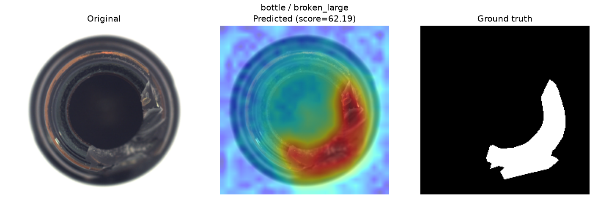

# Self-Supervised Defect Detection

Anomaly detection for visual quality control, trained only on defect-free
("good") images. The model learns the distribution of normal parts and
flags anything that deviates from it — no labeled defect data required for
training, which mirrors real manufacturing settings where defective samples
are rare and expensive to collect.



**Kurz:** PatchCore (WideResNet50 + Coreset-Memory-Bank) · Image-AUROC 0,96–1,00 auf 4 MVTec-AD-Kategorien ·
ehrliche Fehleranalyse am Einsatz-Threshold ([MODEL_CARD.md](MODEL_CARD.md)) · FastAPI-Backend ·
Streamlit-Demo · Produktionssimulation mit SQLite-Event-Log und Live-Monitoring-Dashboard · pytest

## Ziel

- Defekte auf Produktfotos erkennen und lokalisieren (Heatmap/Segmentierung),
  ohne im Training defekte Beispiele zu sehen.
- Baseline auf dem [MVTec AD](https://www.mvtec.com/company/research/datasets/mvtec-ad)
  Datensatz (Kategorie `bottle`, später erweiterbar).
- Deploybare Demo: Bild hochladen -> Anomaly Score + Heatmap zurück.

## Projektstruktur

```
data/               # Rohdaten & verarbeitete Daten (nicht versioniert)
  raw/              # heruntergeladene Archive
  processed/        # ggf. vorverarbeitete/zwischengespeicherte Daten
src/
  models/           # PatchCore-Implementierung
  api/              # FastAPI-Backend (Upload-Endpoint, Inference)
  frontend/         # Streamlit-Upload-Demo
  production/       # Produktionssimulation: Kamera-Feed, Worker, Dashboard
  utils/            # Daten-Download, Loader, Hilfsfunktionen
docs/               # Beispielbilder und Kennzahlen pro Kategorie
tests/              # Unit-/Integrationstests
```

## Setup

```powershell
# venv anlegen und aktivieren
python -m venv venv
.\venv\Scripts\Activate.ps1

# Dependencies installieren
pip install -r requirements.txt
```

## Datensatz herunterladen

MVTec AD hat keinen anonymen Direct-Download-Link — die offizielle Seite
gibt den (personalisierten, befristeten) Link erst nach Ausfüllen eines
kurzen Formulars heraus. Deshalb:

1. [https://www.mvtec.com/company/research/datasets/mvtec-ad](https://www.mvtec.com/company/research/datasets/mvtec-ad)
   öffnen, "Download dataset" klicken, Formular ausfüllen.
2. `mvtec_anomaly_detection.tar.xz` (~4.9 GB) herunterladen und nach
   `data/raw/` legen.
3. Extrahieren (nur die gewünschte Kategorie wird entpackt):

```powershell
python -m src.utils.download_mvtec --category bottle
```

Falls die Datei woanders liegt: `--archive <pfad-zur-tar.xz>` angeben.

### Struktur pro Kategorie

```
bottle/
├── train/
│   └── good/              # nur fehlerfreie Bilder -> Trainingsmenge
├── test/
│   ├── good/
│   ├── broken_large/      # ein Ordner pro Defekttyp
│   └── ...
└── ground_truth/
    ├── broken_large/      # Pixel-Masken, gespiegelt zu test/broken_large
    └── ...
```

## Baseline: PatchCore

Pretrained-Backbone-Patch-Features (WideResNet50, timm) + Coreset-Memory-Bank
aus `train/good`-Patches. Anomaly Score = Distanz zum nächsten Nachbarn in
der Memory Bank; liefert Score pro Bild und eine Heatmap pro Pixel.

```powershell
python -m src.train --category bottle       # baut Memory Bank, speichert nach data/processed/
python -m src.evaluate --category bottle    # AUROC auf dem Testsplit
```

Ergebnis über vier Kategorien (bewusst gewählt: leicht bis schwer, texturell
bis semantisch) — Details und Fehleranalyse siehe [MODEL_CARD.md](MODEL_CARD.md):

| Kategorie | Image-AUROC | Pixel-AUROC |
|-----------|------------:|------------:|
| bottle    | 1.000       | 0.984       |
| cable     | 0.988       | 0.982       |
| screw     | 0.959       | 0.982       |
| pill      | 0.956       | 0.982       |

AUROC allein verschleiert, wie gut das System am tatsächlichen
Entscheidungs-Threshold funktioniert — Recall reicht dort von 0.672
(`screw`) bis 1.000 (`bottle`). Fehleranalyse pro Kategorie (Confusion
Matrix, Recall pro Defekttyp, konkrete Fehlerbeispiele):

```powershell
python -m src.error_analysis --category <name>   # -> data/processed/error_analysis/<name>/
```

Beispiel-Heatmaps (Original / Vorhersage / Ground Truth) erzeugen:

```powershell
python -m src.visualize --category bottle    # -> data/processed/visualizations/bottle/
```

## Backend (FastAPI)

Lädt das trainierte PatchCore-Modell einmalig beim Start und stellt einen
Upload-Endpoint bereit, der Score, Threshold, Verdict (Defect/OK) und eine
Heatmap (Base64-PNG) zurückgibt.

```powershell
uvicorn src.api.main:app --reload
```

- `GET /health` — Status, geladene Kategorie
- `POST /predict` — Bild-Upload (`file`) -> `{category, score, threshold, is_anomaly, heatmap_png_base64}`

Kategorie über die Umgebungsvariable `MVTEC_CATEGORY` wählbar (Default: `bottle`).

## Frontend (Streamlit)

```powershell
streamlit run src/frontend/app.py
```

Bild hochladen -> Original + Heatmap-Overlay nebeneinander, Score/Threshold/
Verdict darunter. Erwartet das Backend unter `http://127.0.0.1:8000`
(überschreibbar via `DEFECT_API_URL`).

## Produktions-Simulation

Die Upload-Demo oben ist für Menschen gedacht. In echter Fertigung läuft es
anders: kein manueller Upload, sondern ein durchgängiger Kamera-Feed, eine
automatisierte Sortier-Entscheidung statt einer Web-Anzeige, und ein
Monitoring-Dashboard statt eines Upload-Formulars. `src/production/`
simuliert genau das:

- **`simulator.py`** — spielt einen Kamera-Feed nach: kopiert Bilder aus dem
  MVTec-Testsplit in konfigurierbarem Intervall und mit konfigurierbarer
  Defektrate (realistisch niedrig, z.B. 10%, statt dem ausbalancierten
  MVTec-Testsplit) nach `data/production/incoming/`
- **`worker.py`** — beobachtet `incoming/` durchgängig, scored jedes neue
  Bild automatisch, sortiert es nach `accepted/` oder `rejected/` (simuliert
  eine physische Weiche) und loggt Score/Entscheidung/Latenz in eine SQLite
  Event-Log (`data/production/events.db`)
- **`dashboard.py`** — Live-Monitoring statt Upload-UI: Durchsatz,
  Accept/Reject-Zahlen, Score-Trend als Drift-Signal, und eine Review-Queue
  mit Heatmaps der zuletzt zurückgewiesenen Teile

```powershell
python -m src.production.worker --category bottle
python -m src.production.simulator --category bottle --interval 1 --defect-rate 0.1
streamlit run src/production/dashboard.py
```

Die Ground-Truth-Genauigkeit im Dashboard ist nur möglich, weil hier
gelabelte Benchmark-Daten "abgespielt" werden — in echter Produktion gäbe es
diese Rückmeldung in Echtzeit nicht.

## Status

Daten-Pipeline, Loader, PatchCore-Baseline auf 4 Kategorien (mit AUROC-
Evaluation + Fehleranalyse, siehe [MODEL_CARD.md](MODEL_CARD.md)), Heatmap-
Visualisierung, FastAPI-Backend, Streamlit-Upload-Demo und eine
Produktions-Simulation (durchgängiger Kamera-Feed -> automatisierte
Sortierung -> Monitoring-Dashboard) stehen — End-to-End getestet.
Nächster Schritt: Deployment auf Hugging Face Spaces.

## Daten & Lizenz

Der MVTec-AD-Datensatz ist **nicht** Teil dieses Repositories und muss wie oben beschrieben selbst
heruntergeladen werden. Er steht unter
[CC BY-NC-SA 4.0](https://creativecommons.org/licenses/by-nc-sa/4.0/) (nur nicht-kommerzielle Nutzung).
Die Beispielbilder in `docs/images/` sind daraus abgeleitet und stehen unter derselben Lizenz.

> P. Bergmann, M. Fauser, D. Sattlegger, C. Steger: *MVTec AD — A Comprehensive Real-World Dataset
> for Unsupervised Anomaly Detection*, CVPR 2019.
